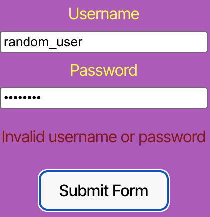

# Module 14 challenge - Kanban Board

**Deployed website:** https://module-14-challenge-kanban-board-gd1x.onrender.com/login

## Usage Instructions
If you want to log as one of our users, you will need to login with one of these usernames and passwords:

```
User 1:
username: JollyGuru
password: password
```
```
User 2:
username: SunnyScribe
password: password
```
```
User 3:
username: RadiantComet
password: password
```

If you want to clone the repo on your computer and start working on it, you will need to:
1. Set up .env file with:
```
DB_NAME=''
DB_USER=''
DB_PASSWORD=''
JWT_SECRET_KEY=''
```

2. Run ```npm i```
3. Run ```npm run build```
4. Run ```npm run start``` or ```npm run start:dev```

## Webpage Guide

### Home Page for users that are not logged in
The user can navigate to the "Login" button and a login form will be displayed


### Login Form
When user enters valid username and password, he/she will be redirected to the Kanban Board. Otherwise, if the username or password is inocrrect an error will be displayed.


Error for incorrect username or password:



### Kanban Board
When user logs in successully, he/she will be presented with a board. On the board there are three categories - "Todo", "In Progress", "Done".


#### On the top right side, these is a "New Ticket" button.
**New Ticket Button:** When the user clicks on the "New Ticket" button, a form will be displayed. User will be able to write ticket name, description and to select status and user's id.


#### Each ticket has two buttons:
**Edit Button:** When the user clicks on the "Edit" button, it will allow them to modify the details of the ticket, such as the title, description and status. After making changes, the user should click "Submit Form" button to apply those changes.


**Delete Button:** When the user clicks on the "Delete" button, the ticket will be removed from the list and database.

### Logging Out
When the user clicks on the "Logout" button, he is redirected to the Home Page for users that are not logged in.